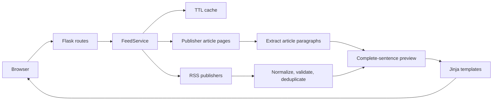

# NewsBrief

A public, responsive Flask news aggregator that turns Australian and
international RSS feeds into a calm, category-first reading experience.
It extracts article text for concise, complete summaries and always links
readers back to the original publisher.


## Why this project

News feeds are fast but often noisy. NewsBrief demonstrates how to
combine concurrent RSS ingestion, defensive web extraction, caching, and
accessible presentation in a small production-oriented Flask application.
No account or demo authentication is required.

## Highlights

- Melbourne, Victoria, Australian national, technology, sports,
  entertainment, business, science and travel coverage
- A distinct weather experience for Melbourne and Victorian regional centres
- Complete-sentence previews extracted from publisher article paragraphs
- Concurrent fetching, URL validation, response-size limits, deduplication,
  UTC sorting, and graceful partial-failure handling
- In-memory TTL cache with manual refresh and observable health metrics
- Responsive, semantic UI with focused empty and error states
- Pytest, coverage, Ruff, mypy, pre-commit, GitHub Actions, Dependabot,
  Docker, non-root runtime, and container health check

## Quick start

```bash
python -m venv .venv
source .venv/bin/activate  # Windows: .venv\Scripts\activate
pip install -r requirements.txt
python main.py
```

Open `http://127.0.0.1:5000`. For a production-style local process:

```bash
waitress-serve --listen=*:8000 --call news_aggregator:create_app
```

## Docker

```bash
docker build -t newsbrief .
docker run --rm -p 8000:8000 newsbrief
```

The health endpoint is available at `GET /health`.

## Development

```bash
pip install -r requirements-dev.txt
ruff check .
ruff format --check .
mypy news_aggregator
pytest --cov
pip-audit -r requirements.txt
```

Copy `.env.example` values into your environment to tune timeouts, response
limits, article counts, cache duration, and logging.

## Architecture



See [Architecture](docs/architecture.md) for request flow, trust boundaries,
and design decisions.

## Screenshots


| Weather theme | Mobile layout |
| --- | --- |
|  |  |

## Data and editorial scope

The application reads public RSS metadata and publisher pages from configured
sources. Headlines, imagery, and article rights remain with their publishers.
Summaries are extractive previews, not independent reporting; readers can
always open the original story.

## Project policies

- [Contributing](CONTRIBUTING.md)
- [Security](SECURITY.md)
- [Code of Conduct](CODE_OF_CONDUCT.md)
- [MIT License](LICENSE)
